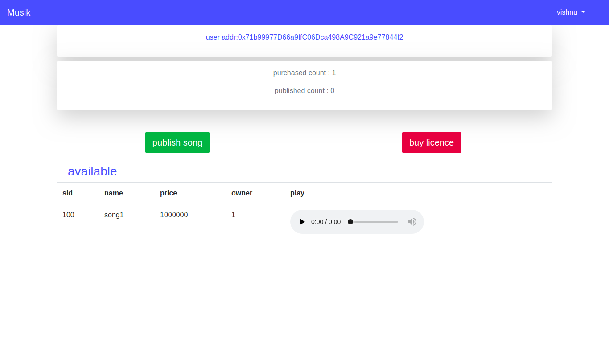

# *MUSIC  DAPP*

DESCRIPTION:

Today piracy is the imperative issue in any field of songs,movies,short videos etc. While we focus on songs, a major portion of piracy related issue can be solved. Many laws have been made to prevent privacy. Internationally, the laws for punishing piracy in developed countries are stringent and punitive in nature. In Asian countries and more in India too, it does not get the attention at the national level due to more engaging issues at hand. However, the industry, especially the IT and music industry, has been taking active interest in stemming the rot. These organizations identify sources of music piracy and then conduct raids with the help of the police. However, convictions are few and the penalties not harsh enough to act as a deterrent.
Using blockchain Technology partially help us to get rid of this problem.Since Blockchain is a distributed ledger technology music that content owner uploads to the network gets distributed along the whole network.We use IPFS as protocol to store file thus it is distributed.The content owner can upload thier songs to ipfs. If any user wants the songs they have to buy licence from the content ower by transfering some ether. No central authority is come under this whole system like traditional systems do.Like youtube,Gaana,Saavan while we buy a song we are tranferring money to them,not the creator.If he want to get paid what he created users are intended to pay directly to the creator.Thats where blockchain play a mojor role.This Dapp contains a user registraion page & a login page. If song published dapp shows song details such as songID, songName,publisherID.If user buys the song Dapp lists the userID,publisherID,price and a audio player.

SYSTEM REQUIRMENT:

Operating System: ubuntu 16.04
system RAM :4GB or above (recommended 8GB)
Free system storage: 4GB on  /home

INSTALLATION PREREQUISTIES

1) Ensure that NodeJS is installed in the system. For more information about NodeJS, go to NodeJS website [ https://nodejs.org ].To check       if     NodeJs is installed, open a terminal window, run following command: $ node -v.

2)If NodeJS is not installed, go to [ https://nodejs.org ] and download the compatible version based on your operating system.To install    	through a terminal window, run following command:   $ sudo apt-get install -y nodejs.

3)Ensure that Truffle is installed. Truffle Suite helps to develop Dapps easily. For more information, go to [ https://truffleframework.com/ ].
To check if Truffle is installed, run following command in the terminal window:   $ truffle version

4)If Truffle is not installed, run following command in the terminal window:  $ npm install -g truffle

5)Ensure that Geth is installed. Geth is the official Golang implementation of the Ethereum protocol.To check if Geth is installed, run following command in the terminal window:    $ geth version.

6)To install Geth, run following command in the terminal window:
   $ sudo apt-get install software-properties-common
   $ sudo add-apt-repository -y ppa:ethereum/ethereum
   $ sudo apt-get update
   $ sudo apt-get install ethereum

METHOD FOR INSTALLATION AND USING DAPP WITH TRUFFLE:

1)Downlaod the folder “Dapp”

2)Open the terminal inside the Dapp folder and give command ‘npm install’ .

3)Run Geth and unlock  5 user accounts using the command 
      geth --identity "miner" --networkid 4002 --datadir. dev --rpc --rpcport "8545" --unlock 0,1,2,3,4 --ipcpath "~/.ethereum/geth.ipc" --  rpccorsdomain "*" --rpcapi "db,eth,net,web3,personal" -–dev

4)Once we set it asks the passphrase .No password is given so skip by entering enter 

5)Open another terminal and give the terminal : geth attach

6)it opens the javascript console and start mining : miner.start()

7)Our project uses IPFS make sure to install ipfs by giving  the command
             npm install ipfs-api

8)Before truffle compile ,check account balance by eth.getBalance(eth.getBalance(eth.accounts[0]))

9)If running out of gas then tranfer some ether to each account using 
eth.sendTransaction({from:eth.accounts[0],to:eth.accounts[1],value:50000000000000})      //transfer to every account .

10)Go to the terminal project-Truffle and run commands 
            truffle compile
11)Then ,
             truffle migrate 
  make sure mining is done background

12)Then,
         npm start

13)Inside the Dapp:
   First register user by giving username(uname),userid(uid), account address

14)For accsessing account address use the following command in javascript console
           eth.accounts

15)copy and paste any of the user account to register

16)After registration successfull Login the user by giving uid and address

17)Registered user can pubish a song by giving songid, songName & price of the song.

18)Choose a file and publish ,it directly uploads to IPFS.

19)Likewise Register another user & login.

20)If he wants to publish a song he can.

21)If he wants to buy a song that another user published, give songID and buy.

22)Refresh the page, it shows songID,songName,Publisher , and small audio tab to play the music.

23)Downloading access is restricted
 	

